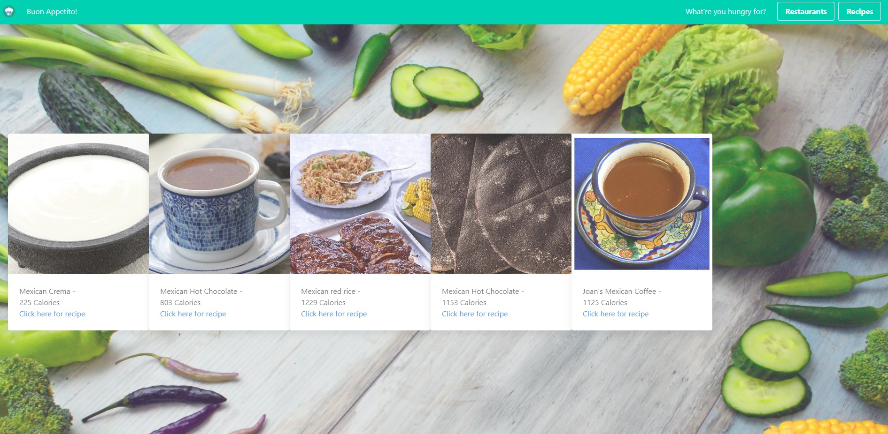
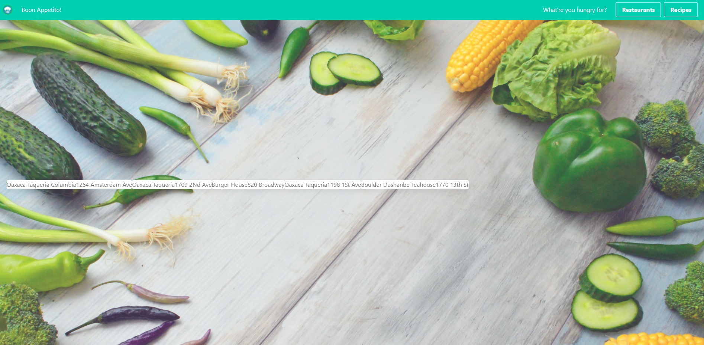
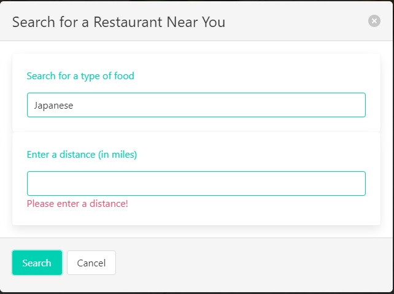
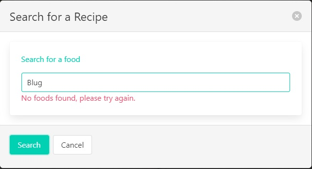
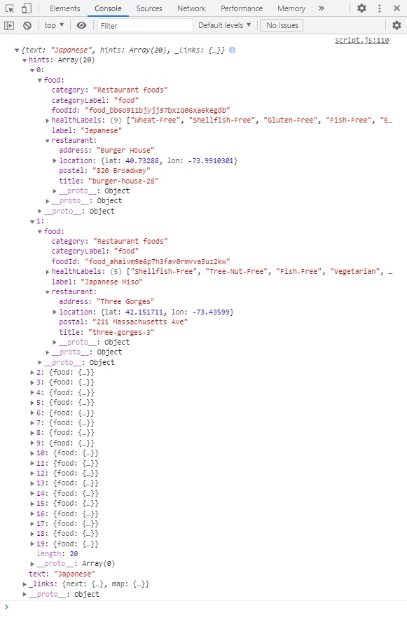

Page Link : https://uoftgroup7.github.io/mealThyme/

# Recipe and Restaurant Locator
A website where users can choose whether they want to search for a food recipe or a restaurant near them based on type of food.

### Criteria:
* Ask user what to search for
  *  Present different search questions depending on button clicked
  *  Verify user entered correct inputs
* Present results on main body of webpage
  * Include an image for recipes (if available)
  * Google maps direction for restaurants
* Results are cleared upon new search
* Results stored in local storage and persists on page refresh

### Web tools used
* HTML
* CSS
  *  Bulma CSS
  *  Basic CSS
* Javascript
* Edamam API (https://www.edamam.com/)
* ipFind API (https://ipfind.com/docs/)

### Website

## Contributors
* Tugrul
* Sarah
* Zohaib
* Zeid
* Tony
* Kenson

## Final Results

### Main landing page

### Recipe Results

### Restaurant Results

### Examples of Input and Error Checking

### Backend API call example
